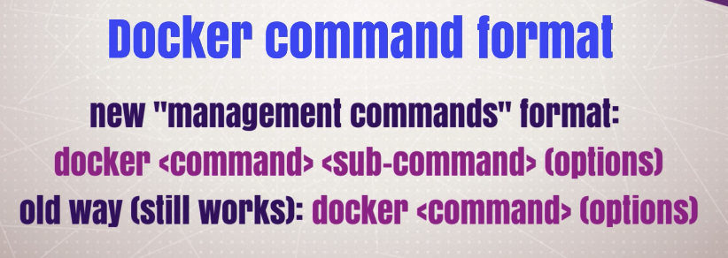

# The Best Way to Set Up Docker for Your OS

## Docker for Windows 10 Pro/Ent: Setup and Tips

http://store.docker.com

```sh
docker version

Client: Docker Engine - Community
 Version:           19.03.8
 API version:       1.40
 Go version:        go1.12.17
 Git commit:        afacb8b
 Built:             Wed Mar 11 01:21:11 2020
 OS/Arch:           darwin/amd64
 Experimental:      false

Server: Docker Engine - Community
 Engine:
  Version:          19.03.8
  API version:      1.40 (minimum version 1.12)
  Go version:       go1.12.17
  Git commit:       afacb8b
  Built:            Wed Mar 11 01:29:16 2020
  OS/Arch:          linux/amd64
  Experimental:     false
 containerd:
  Version:          v1.2.13
  GitCommit:        7ad184331fa3e55e52b890ea95e65ba581ae3429
 runc:
  Version:          1.0.0-rc10
  GitCommit:        dc9208a3303feef5b3839f4323d9beb36df0a9dd
 docker-init:
  Version:          0.18.0
  GitCommit:        fec3683
```

```
git clone https://github.com/BretFisher/udemy-docker-mastery.git

cd .\udemy-docker-mastery\
```

Return a lot more stuffs (vs version)
```
docker info
```

To shows all commands, type simply `docker`



```
(base) Pasquales-MacBook-Pro:udemy-docker-mastery pasqualespica$ docker COMMAND --help

Usage:	docker [OPTIONS] COMMAND

A self-sufficient runtime for containers

Options:
      --config string      Location of client config files (default "/Users/pasqualespica/.docker")
  -c, --context string     Name of the context to use to connect to the daemon (overrides DOCKER_HOST env var and default context set with "docker context use")
  -D, --debug              Enable debug mode
  -H, --host list          Daemon socket(s) to connect to
  -l, --log-level string   Set the logging level ("debug"|"info"|"warn"|"error"|"fatal") (default "info")
      --tls                Use TLS; implied by --tlsverify
      --tlscacert string   Trust certs signed only by this CA (default "/Users/pasqualespica/.docker/ca.pem")
      --tlscert string     Path to TLS certificate file (default "/Users/pasqualespica/.docker/cert.pem")
      --tlskey string      Path to TLS key file (default "/Users/pasqualespica/.docker/key.pem")
      --tlsverify          Use TLS and verify the remote
  -v, --version            Print version information and quit
```
### Management Commands:
```
Management Commands:
  builder     Manage builds
  config      Manage Docker configs
  container   Manage containers
  context     Manage contexts
  image       Manage images
  network     Manage networks
  node        Manage Swarm nodes
  plugin      Manage plugins
  secret      Manage Docker secrets
  service     Manage services
  stack       Manage Docker stacks
  swarm       Manage Swarm
  system      Manage Docker
  trust       Manage trust on Docker images
  volume      Manage volumes
```

### Commands
```
Commands:
  attach      Attach local standard input, output, and error streams to a running container
  build       Build an image from a Dockerfile
  commit      Create a new image from a container's changes
  cp          Copy files/folders between a container and the local filesystem
  create      Create a new container
  diff        Inspect changes to files or directories on a container's filesystem
  events      Get real time events from the server
  exec        Run a command in a running container
  export      Export a container's filesystem as a tar archive
  history     Show the history of an image
  images      List images
  import      Import the contents from a tarball to create a filesystem image
  info        Display system-wide information
  inspect     Return low-level information on Docker objects
  kill        Kill one or more running containers
  load        Load an image from a tar archive or STDIN
  login       Log in to a Docker registry
  logout      Log out from a Docker registry
  logs        Fetch the logs of a container
  pause       Pause all processes within one or more containers
  port        List port mappings or a specific mapping for the container
  ps          List containers
  pull        Pull an image or a repository from a registry
  push        Push an image or a repository to a registry
  rename      Rename a container
  restart     Restart one or more containers
  rm          Remove one or more containers
  rmi         Remove one or more images
  run         Run a command in a new container
  save        Save one or more images to a tar archive (streamed to STDOUT by default)
  search      Search the Docker Hub for images
  start       Start one or more stopped containers
  stats       Display a live stream of container(s) resource usage statistics
  stop        Stop one or more running containers
  tag         Create a tag TARGET_IMAGE that refers to SOURCE_IMAGE
  top         Display the running processes of a container
  unpause     Unpause all processes within one or more containers
  update      Update configuration of one or more containers
  version     Show the Docker version information
  wait        Block until one or more containers stop, then print their exit codes
```


- command: `docker version`
  -   verified cli can talk to engine

-  command: `docker info`
   - most config values of engine

- docker command line structure
    - old (still works): `docker <command> (options)`
    - new: `docker <command> <sub-command> (options)`

## Docker for Mac Setup and Tips

http://store.docker.com

`docker version`

http://github.com/BretFisher/udemy-docker-mastery

`docker version`

`docker container`

`docker container run --`

`docker`

`docker pause`

## Docker for Linux Setup and Tips

docker

http://get.docker.com

curl -fsSL get.docker.com -o get-docker.sh

sh get-docker.sh

sudo usermod -aG docker bret

sudo docker version

docker version

sudo docker version

docker-machine version

http://github.com/docker/compose

http://github.com/docker/compose/releases

curl -L https://github.com/docker/compose/releases/download/1.15.0/docker-compose- `uname -s `- `uname -m` >/usr/local/bin/docker-compose

docker-compose version

http://github.com/docker/machine/releases

http://github.com/BretFisher/udemy-docker-mastery

git clone https://github.com/Bretfisher/udemy-docker-mastery.git

cd udemy-docker-mastery/

docker image

docker image ls --
