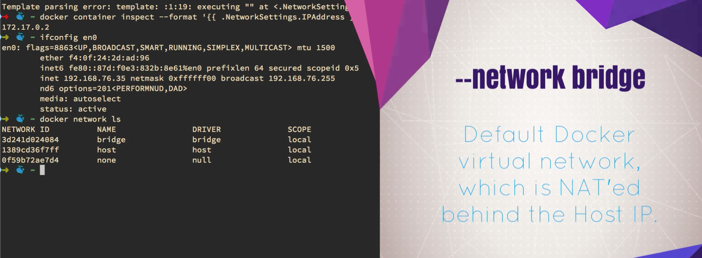
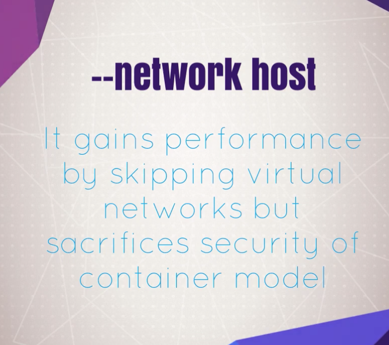
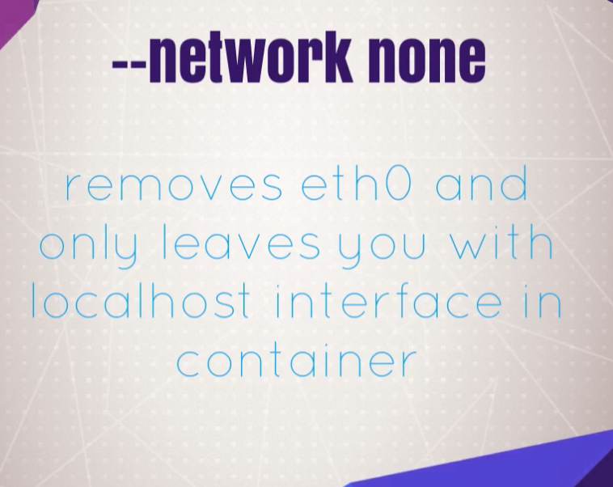
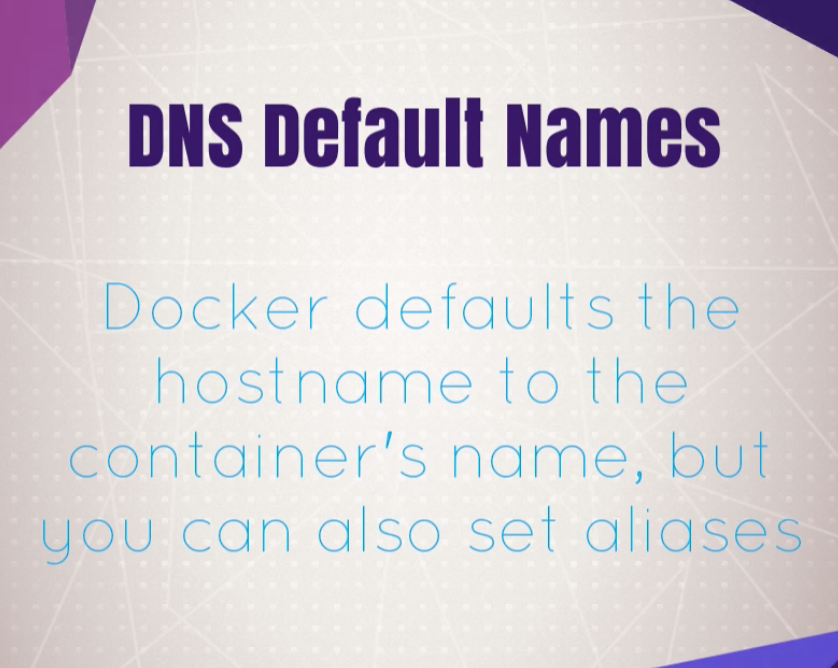

# Creating and Using Containers Like a Boss

What's In This Section
- Check versions of our docker cli and engine
- Create a Nginx (web server) container
- Learn common container management commands
- Learn Docker networking basics
- Requirements: Have latest Docker installed from last Section

### Image vs. Container

- An Image is the application we want to run
- A Container is an instance of that image running as a process
- You can have many containers running off the same image
- In this lecture our image will be the Nginx web server
- Docker's default image "registry" is called Docker Hub (hub.docker.com)


## Check Our Docker Install and Config

```
docker version

docker info

docker

docker container run

docker run
```

## Starting a Nginx Web Server

`docker container run --publish 80:80 nginx`

1. Downloaded image 'nginx' from Docker Hub
2. Started a new container from that image
3. Opened port 80 on the host IP
4. Routes that traffic to the container IP, port 80

### What happens in 'docker container run'

1. Looks for that image locally in image cache, doesn't find anything
2. Then looks in remote image repository (defaults to Docker Hub)
3. Downloads the latest version (nginx:latest by default)
4. Creates new container based on that image and prepares to start
5. Gives it a virtual IP on a private network inside docker engine
6. Opens up port 80 on host and forwards to port 80 in container
7. Starts container by using the CMD in the image Dockerfile


`docker container run --publish 80:80 --detach nginx`

```
(base) Pasquales-MacBook-Pro:~ pasqualespica$ docker container run --publish 80:80 --detach nginx
82d8bfdaf776cd3fe524c66b7fc2b44cfc23027263ad8040a7a90c54f5b6a6cc
(base) Pasquales-MacBook-Pro:~ pasqualespica$ docker container ls
CONTAINER ID        IMAGE               COMMAND                  CREATED             STATUS              PORTS                NAMES
82d8bfdaf776        nginx               "/docker-entrypoint.…"   21 seconds ago      Up 19 seconds       0.0.0.0:80->80/tcp   determined_jennings
```

return a *unique ID*

`docker container ls`

`docker container stop 82d8bfdaf776` 

default shows all containers just running 
`docker container ls`

Show all containers
`docker container ls -a`

if you don't specify a name a random name `<adjective><noun>` ex. `dreamy_einstein` is assgined otherwise
`docker container run --publish 80:80 --detach --name webhost nginx`

```
(base) Pasquales-MacBook-Pro:~ pasqualespica$ docker container run --publish 56565:80 --detach --name webhost nginx
6f004811074315d4a253829cc5081449149cccf1e1f08302f1c3e0262d41afe0
(base) Pasquales-MacBook-Pro:~ pasqualespica$ docker container ls
CONTAINER ID        IMAGE               COMMAND                  CREATED             STATUS              PORTS                   NAMES
6f0048110743        nginx               "/docker-entrypoint.…"   2 seconds ago       Up 1 second         0.0.0.0:56565->80/tcp   webhost
```

`docker container ls -a`

Fetch the logs of a container
`docker container logs webhost`

docker container top : Display the running processes of a container
`docker container top webhost`

```
(base) Pasquales-MacBook-Pro:~ pasqualespica$ docker container top webhost1
PID                 USER                TIME                COMMAND
7259                root                0:00                nginx: master process nginx -g daemon off;
7320                101                 0:00                nginx: worker process
```

`docker container --help`

`docker container ls -a`

`docker container rm 63f 690 ode`

`docker container ls`

Stop the container before attempting removal or force remove
`docker container rm -f 63f`

docker container ls -a

## Container VS. VM: It's Just a Process

### Cgroups, namespaces, and beyond: what are containers made from? 
https://www.youtube.com/watch?v=sK5i-N34im8&feature=youtu.be&list=PLBmVKD7o3L8v7Kl_XXh3KaJl9Qw2lyuFl

### Docker Virtualization Admin
https://github.com/mikegcoleman/docker101/blob/master/Docker_eBook_Jan_2017.pdf

### Docker for Mac Commands for Getting Into The Local Docker VM
https://www.bretfisher.com/docker-for-mac-commands-for-getting-into-local-docker-vm/

### Option 1: use Screen (not as easy as nsenter)
Note this isn't a list of commands to run in order. The first one gets you in the VM (hit return twice to see a prompt). Then other commands are for managing that connection. Not a great CLI expirence but gets the job done. Using the ctrl- options prevents garbled text on reconnect.

connect to `tty` on Docker for Mac VM

`screen ~/Library/Containers/com.docker.docker/Data/vms/0/tty`

disconnect that session but leave it open in background

`Ctrl-a d`

list that session that's still running in background

`screen -ls`

reconnect to that session (don't open a new one, that won't work and 2nd tty will give you garbled screen)

`screen -r`

kill this session (window) and exit

`Ctrl-a k`

### Container vs Virtual-Machine
- Containers aren’t Mini-VM’s
- They are just processes
- Limited to what resources they can access (file paths, network devices, running processes)
- Exit when process stops

`docker run --name mongo -d mongo`

list running processes in specific container 
`docker top mongo`

ps aux

docker stop mongo

ps aux

docker run --name mongo -d mongo

you can use `docker ps` (*older command*) like `docker container ls`

`docker top mongo`

`docker stop mongo`

`docker ps`

`docker top mongo`

`docker start mongo`

`docker ps`

`docker top mongo`

## Assignment Answers: Manage Multiple Containers

- Clean it all up with `docker container stop` and `docker container rm` (both can accept multiple names or ID's)

`docker container top` - process list in one container 
`docker container inspect` - details of one container config
`docker container stats` - performance stats for all containers

1. mysql 

`docker container run -d -p 3306:3306 --name db -e MYSQL_RANDOM_ROOT_PASSWORD=yes mysql`

then type
`docker container logs db` to find pwd like thi

```
GENERATED ROOT PASSWORD: gaa1EeFo4bah3ih0eHaj8iolu3hesh9j
```


2. httpd
`docker container run -d --name webserver -p 8080:80 httpd`

`docker ps`

3. nginx
`docker container run -d --name proxy -p 80:80 nginx`

`docker ps`

`docker container ls`


Try to see apache typing ... 
```
(base) Pasquales-MacBook-Pro:~ pasqualespica$ curl localhost:8080
<html><body><h1>It works!</h1></body></html>
```

`docker container stop TAB COMPLETION`
or to stop all active container
`docker container stop $(docker container ls -q)`

```
docker ps -a
docker container ls -a
docker container rm
docker ps -a
docker image ls
```

## What's Going On In Containers: CLI Process Monitoring

**Run**
```
docker container run -d --name nginx nginx
docker container run -d --name mysql -e MYSQL_RANDOM_ROOT_PASSWORD=true mysql
```

**Show it**
```
docker container ls
docker container top mysql
docker container top nginx
```

Display detailed information on one or more containers
`docker container inspect mysql`  
show a **json** info file

Display a live stream of container(s) resource usage statistics
(defaults show all)
`docker container stats <OPTIONAL CONTAINERS>`

## Getting a Shell Inside Containers: No Need for SSH

- `docker container run -it`  start new container interactively 
- `docker container exec -it` run additional command in existing container

`docker container run -it --name proxy nginx bash`
    -i, --interactive                    Keep STDIN open even if not attached
    -t, --tty                            Allocate a pseudo-TTY
`docker container run --help`

```
docker container ls
docker container ls -a
docker container run -it --name ubuntu ubuntu
docker container ls
docker container ls -a
```

```
docker container start --help
docker container start -ai ubuntu
```

Run a command in a running container
`docker container exec --help`

`docker container exec -it mysql bash`

```
docker container ls
docker pull alpine
docker image ls
```

`docker container run -it alpine bash`

`docker container run -it alpine sh`


## Docker Networks: Concepts for Private and Public Comms in Containers
https://docs.docker.com/config/formatting/

- Review of `docker container run -p`
- For local dev/testing, networks usually "just work"
- Quick port check with `docker container port <container>`
- Learn concepts of Docker Networking
- Understand how network packets move around Docker

### Docker Networks `Defaults`

- Each container connected to a private virtual network "bridge"
- Each virtual network routes through NAT firewall on host IP
- All containers on a virtual network can talk to each other without -p
-  Best practice is to create a new virtual network for each app:
- network "my_web_app" for mysql and php/apache containers
- network "my_api" for mongo and nodejs containers

### Docker Networks Cont.

- "Batteries Included, But Removable"
- Defaults work well in many cases, but easy to swap out parts to customize it
- Make new virtual networks
- Attach containers to more then one virtual network (or none)
- Skip virtual networks and use host IP (`--net=host`)
- Use different Docker network drivers to gain new abilities


`docker container run -p 80:80 --name webhost -d nginx`

List port mappings or a specific mapping for the container
`docker container port webhost`

`docker container inspect --format '{{ .NetworkSettings.IPAddress }}' webhost`

## Docker Networks: CLI Management of Virtual Networks

- Show networks `docker network ls`
- Inspect a network `docker network inspect`
- Create a network `docker network create --driver`
- Attach a network to container `docker network connect`
- Detach a network from container `docker network disconnect`

*default network*


*direct access to HOST network*


*NONE network*


```
docker network ls
docker network inspect bridge
```

`docker network ls`

`docker network create --help`
```
Usage:	docker network create [OPTIONS] NETWORK

Create a network

Options:
      --attachable           Enable manual container attachment
      --aux-address map      Auxiliary IPv4 or IPv6 addresses used by Network driver (default map[])
      --config-from string   The network from which copying the configuration
      --config-only          Create a configuration only network
  -d, --driver string        Driver to manage the Network (default "bridge")
      --gateway strings      IPv4 or IPv6 Gateway for the master subnet
      --ingress              Create swarm routing-mesh network
      --internal             Restrict external access to the network
      --ip-range strings     Allocate container ip from a sub-range
      --ipam-driver string   IP Address Management Driver (default "default")
      --ipam-opt map         Set IPAM driver specific options (default map[])
      --ipv6                 Enable IPv6 networking
      --label list           Set metadata on a network
  -o, --opt map              Set driver specific options (default map[])
      --scope string         Control the network's scope
      --subnet strings       Subnet in CIDR format that represents a network segment
```

`docker network create my_app_net`

To default `network create` command increment the subent exmaple `172.20.0.2/16` and so on, start from `172.17.0.3/16` of default `bridge` 

`docker network ls`

`docker container run -d --name new_nginx --network my_app_net nginx`

`docker network inspect my_app_net`

`docker network --help`

`docker network connect <NET> <CONTAINER>`

1. **connect net from container**
`docker network connect my_app_net webhost`

with `docker container inspect` you see change **CONTAINER** side 

```
            "Networks": {
                "bridge": {
                    "Gateway": "172.17.0.1",
                    "IPAddress": "172.17.0.2",
                },
                "my_app_net": {
                    "Gateway": "172.20.0.1",
                    "IPAddress": "172.20.0.3",
```

with `docker network inspect` you see change **NETWORK** side
```
"ConfigOnly": false,
"Containers": {
    "6501d28356f343ceaf315dfeea7f59d3631fd8f35b7ea621a960139ffe465949": {
        "Name": "webhost",
        "IPv4Address": "172.20.0.3/16",
    },
    "99a84163852b1e6471637ae4618dde50fbde8ab57d235345e1b4443dab7735e2": {
        "Name": "new_nginx",
        "IPv4Address": "172.20.0.2/16",
    }
},
```

2. **disconnect net from container**
`docker network disconnect my_app_net webhost`

## Docker Networks: DNS and How Containers Find Each Other

### Docker Networks: Default Security

- Create your apps so frontend/backend sit on same Docker network
- Their inter-communication never leaves host
- All externally exposed ports closed by default
- You must manually expose via -p, which is better default security!
- This gets even better later with `Swarm` and Overlay networks

https://howdns.works/ep1/
https://dyn.com/blog/dns-why-its-important-how-it-works/

```
docker container run -d --name my_n1 --network my_app_net nginx
docker container run -d --name my_n2 --network my_app_net nginx
```

`docker container exec -it my_n1 ping my_n2`

**NOTE** 
INSTALL `ping` before
```
(base) Pasquales-MacBook-Pro:amqp_Qpid pasqualespica$ docker container exec -it my_n1 bash
root@74b74a0979c6:/# apt-get install iputils-ping
```

```
PING my_n2 (172.20.0.3) 56(84) bytes of data.
64 bytes from my_n2.my_app_net (172.20.0.3): icmp_seq=1 ttl=64 time=0.389 ms
64 bytes from my_n2.my_app_net (172.20.0.3): icmp_seq=2 ttl=64 time=0.101 ms
64 bytes from my_n2.my_app_net (172.20.0.3): icmp_seq=3 ttl=64 time=0.096 ms
```



**Attention** DSN isn't install on `bridge` docker network 
in this case you should use `--link` option
```
    docker container run --help 
    --link list                      Add link to another container

    specify manual link 
 ```

## Assignment: CLI App Testing

- Use different Linux distro containers to check `curl` cli tool version
- Use two different terminal windows to start bash in both `centos:7` and `ubuntu:14.04`, using -it
- Learn the `docker container run —rm` option so you can save cleanup
- Ensure `curl` is installed and on latest version for that distro
  - ubuntu: `apt-get update && apt-get install curl`
  - centos: `yum update curl`
- Check `curl --version`


## Assignment Answers: Using Containers for CLI Testing

- Know how to use -it to get shell in container
- Understand basics of what a Linux distribution is like Ubuntu and CentOS
- Know how to run a container 😬
- Understand basics of DNS records

### Assignment: DNS Round Robin Test

- Ever since Docker Engine 1.11, we can have multiple containers on a created network respond to the same DNS address
- Create a new virtual network (default bridge driver)
- Create two containers from `elasticsearch:2 image`
- Research and use `—network-alias` search when creating them to give them an additional DNS name to respond to
- Run `alpine nslookup search` with `--net` to see the two containers list for the same DNS name
- Run centos `curl -s search:9200` with `--net` multiple times until you see both "name" fields show

**Note**
1. `nslookup` (name server lookup) is a tool used to perform DNS lookups in Linux
2. `--rm` Automatically remove the container when it exits

## Assignment Answers: DNS Round Robin Testing
```     
    --network-alias list             Add network-scoped alias for the container `
```

`docker network create dude`

run 2 instance of elasticsearch:2
```
docker container run -d --net dude --net-alias search elasticsearch:2
docker container run -d --net dude --net-alias search elasticsearch:2
```

`docker container ls`

`docker container run --rm --net dude alpine nslookup search`

```
Server:		127.0.0.11
Address:	127.0.0.11:53

Non-authoritative answer:
Name:	search
Address: 172.21.0.2
Name:	search
Address: 172.21.0.3
```

`docker container run --rm --net dude centos curl -s search:9200`

```
{
  "name" : "Kl'rt",
  "cluster_name" : "elasticsearch",
  "cluster_uuid" : "pZNyxJn1R5K9vcPYBdleeQ",
  "version" : {
    "number" : "2.4.6",
    "build_hash" : "5376dca9f70f3abef96a77f4bb22720ace8240fd",
    "build_timestamp" : "2017-07-18T12:17:44Z",
    "build_snapshot" : false,
    "lucene_version" : "5.5.4"
  },
  "tagline" : "You Know, for Search"
}
```

```
docker container ls
docker container rm -f TAB COMPLETION
```