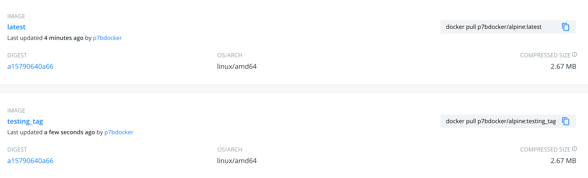

# Container Images, Where To Find Them and How To Build Them

This Section
- All about images, the building blocks of containers
- What's in an image (and what isn't)
- Using Docker Hub registry
- Managing our local image cache
- Building our own images
- VOLUME and mounting host data
- Images for different CPU architectures
- Windows images and how they differ


## What's In An Image (And What Isn't)

- App binaries and dependencies
- Metadata about the image data and how to run the image
- Official definition: "An Image is an ordered collection of root filesystem changes and the
  execution parameters for use within a container runtime."
- Not a complete OS. No kernel, kernel modules (e.g. drivers)
- Small as one file (your app binary) like a golang static binary
- Big as a Ubuntu distro with apt, and Apache, PHP, and more installed

## The Mighty Hub: Using Docker Hub Registry Images

http://hub.docker.com

```
docker image ls

docker pull nginx

docker pull nginx:1.11.9

docker pull nginx:1.11

docker pull nginx:1.11.9-alpine

docker image ls
```

## Images and Their Layers: Discover the Image Cache

`docker image ls`

Show the history of an image layers 
`docker image history nginx:latest`

`docker image history mysql`

Display detailed information on one or more images ( METADATA )
`docker image inspect nginx`

## Image and Their Layers: Review

- Images are made up of file system changes and metadata
- Each layer is uniquely identified and only stored once on a host
- This saves storage space on host and transfer time on push/pull
- A container is just a single read/write layer on top of image
- `docker image history` and `inspect` commands can teach us


## Image Tagging and Pushing to Docker Hub

- All about image tags
- How to upload to Docker Hub
- Image ID vs. Tag

`docker image tag -- help`

```
Run 'docker COMMAND --help' for more information on a command.
(base) Pasquales-MBP:~ pasqualespica$ docker image tag --help

Usage:	docker image tag SOURCE_IMAGE[:TAG] TARGET_IMAGE[:TAG]

Create a tag TARGET_IMAGE that refers to SOURCE_IMAGE
```


`docker image ls`

`docker pull mysql/mysql-server`

`docker image ls`

`docker pull nginx:mainline`

`docker image ls`

`docker image tag nginx bretfisher/nginx`


Usage:	docker image tag SOURCE_IMAGE[:TAG] TARGET_IMAGE[:TAG]
*Create a tag TARGET_IMAGE that refers to SOURCE_IMAGE*
`docker image tag --help`

docker image ls

`docker image push bretfisher/nginx`
but shoud be logged

```
docker --help
docker login
```

`cat .docker/config.json`

push with `latest` defautl tag
```
docker image push bretfisher/nginx
```

now we add a tag
`docker image tag bretfisher/nginx bretfisher/nginx:testing`

and the push tagged images 

`docker image push bretfisher/nginx:testing`

Exmaple `pull` alpine and `push` on my localhub [p7bdocker](https://hub.docker.com/u/p7bdocker)

1. `docker pull alpine`
2. `docker image tag alpine p7bdocker/alpine`
3. `docker image push p7bdocker/alpine`

```
The push refers to repository [docker.io/p7bdocker/alpine]
50644c29ef5a: Pushed
latest: digest: sha256:a15790640a6690aa1730c38cf0a440e2aa44aaca9b0e8931a9f2b0d7cc90fd65 size: 528
```

now add new tog 
4. `docker image tag p7bdocker/alpine p7bdocker/alpine:testing_tag`
5. `pasqualespica$ docker image push p7bdocker/alpine:testing_tag`
```
The push refers to repository [docker.io/p7bdocker/alpine]
50644c29ef5a: Layer already exists
testing_tag: digest: sha256:a15790640a6690aa1730c38cf0a440e2aa44aaca9b0e8931a9f2b0d7cc90fd65 size: 528
```




## Building Images: The Dockerfile Basics

`Dockerfile reference`
https://docs.docker.com/engine/reference/builder/

Traditionally, the Dockerfile is called `Dockerfile` and located in the root of the context. 
You use the `-f` flag with docker `build` to point to a Dockerfile anywhere in your file system.
`$ docker build -f /path/to/a/Dockerfile .`

Dockerfile basics

- `FROM` (base image)
- `ENV` (environment variable)
- `RUN` (any arbitrary shell command)
- `EXPOSE` (open port from container to virtual network)
- `CMD` (command to run when container starts)
- `docker image build` (create image from Dockerfile)


## Building Images: Running Docker Builds

`cd commands/repo_gihub/udemy-docker-mastery/dockerfile-sample-1`

`docker image build -t customnginx .`

`docker image ls`


## Building Images: Extending Official Images

cd dockerfile-sample-2

this is the original versione of nginx
`docker container run -p 80:80 --rm nginx`

now build our nginx HOMEPAGE starting from Dockerfile 
`docker image build -t nginx-with-html .`

`docker container run -p 80:80 --rm nginx-with-html`

```
docker image ls

docker image tag --help

docker image tag nginx-with-html:latest bretfisher/nginx-with-html:latest

docker image ls

docker push
```


## Assignment Answers: Build Your Own Dockerfile and Run Containers From It

Assignment: Build Your Own Image

- Dockerfiles are part process workflow and part art
- Take existing Node.js app and Dockerize it
- Make `Dockerfile`. Build it. Test it. Push it. (rm it). Run it.
- Expect this to be iterative. Rarely do I get it right the first time.
- Details in `dockerfile-assignment-1/Dockerfile`
- Use the Alpine version of the official '`node`' 6.x image
- Expected result is web site at http://localhost
- Tag and push to your Docker Hub account (free)
- Remove your image from local cache, run again from Hub

`cd dockerfile-assignment-1`


1. `docker build -t testnode .`

2. `docker container run --rm -p 80:3000 testnode`

```
docker images

docker tag --help

docker tag testnode bretfisher/testing-node

docker push --help

docker push bretfisher/testing-node

docker image ls

docker image rm bretfisher/testing-node
```

`docker container run --rm -p 80:3000 bretfisher/testing-node`

## Using Prune to Keep Your Docker System Clean (YouTube)

You can use `prune` commands to clean up images, volumes, build cache, and containers. 
Examples include:

- `docker image prune` to clean up just "dangling" images

- `docker system prune` will clean up everything

- The big one is usually `docker image prune -a` which will remove all images you're not using. 
  Use `docker system df` to see space usage.

```
(base) Pasquales-MBP:dockerfile-assignment-1 pasqualespica$ docker system df
TYPE                TOTAL               ACTIVE              SIZE                RECLAIMABLE
Images              35                  22                  6.742GB             2.973GB (44%)
Containers          59                  22                  1.718GB             1.718GB (99%)
Local Volumes       8                   6                   989.7MB             314.8MB (31%)
Build Cache         0                   0                   0B                  0B
```

Remember each one of those commands has options you can learn with `--help`.

Here's a YouTube video I made about it: https://youtu.be/_4QzP7uwtvI

Lastly, realize that if you're using Docker Toolbox, the Linux VM won't auto-shrink. You'll need to delete it and re-create (make sure anything in docker containers or volumes are backed up). You can recreate the toolbox default VM with docker-machine rm default and then docker-machine create

